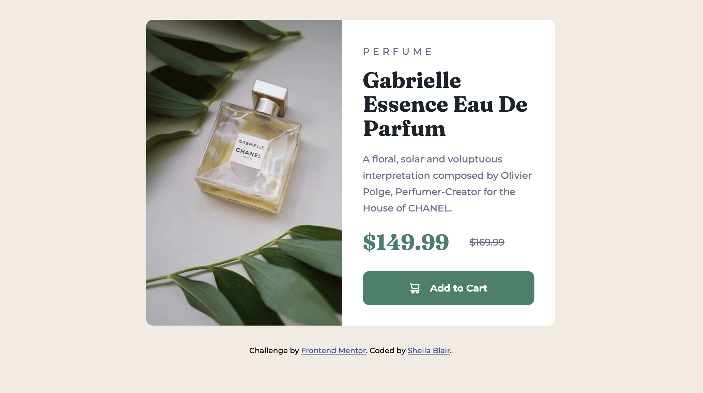

# Frontend Mentor - Product preview card component solution

This is a solution to the [Product preview card component challenge on Frontend Mentor](https://www.frontendmentor.io/challenges/product-preview-card-component-GO7UmttRfa). Frontend Mentor challenges help you improve your coding skills by building realistic projects.

## Table of contents

- [Overview](#overview)
  - [The challenge](#the-challenge)
  - [Screenshot](#screenshot)
  - [Links](#links)
- [My process](#my-process)
  - [Built with](#built-with)
  - [What I learned](#what-i-learned)
  - [Continued development](#continued-development)
  - [Useful resources](#useful-resources)
- [Author](#author)
- [Acknowledgments](#acknowledgments)

## Overview

### The challenge

Users should be able to:

- View the optimal layout depending on their device's screen size
- See hover and focus states for interactive elements

### Screenshot

### Links

- [Solution](https://github.com/sheblair/product-preview-card)
- [Live site](https://sheblair.github.io/product-preview-card/)

## My process

I didn't do a great job documenting my process during the first phase, when I initially built everything. Then a couple of months went by, I came back to look it over and noticed some errors in the styling that needed to be fixed. This time around I did a much better job documenting, so these notes are from that second half of working on it.

1. The first thing I noticed when I was fixing issues was that for some reason my image in the desktop style wasn't covering the full width of its container. There was this strange "extra" space in I could see in DevTools, where the flexbox container continued without the image filling it up. It honestly took me forever to figure this out, I kept adjusting things and nothing worked until I realized it was because I had used a margin instead of padding in the content to the right of the image. When I switched it to padding the image snapped correctly into place. This happened a few more times as I fixed issues in CSS -- I realized I need some more practice with when to use margins vs. padding! Likely I will keep working on this for some time.
2. Tweaking the mobile layout was very chill, I didn't do much other than get more accurate measurements from the design file to fix the padding, and fixed the height of the image. Little stuff.
3. When I moved on to the desktop style, my biggest real issue was getting the image height. Working with responsive design, I wanted to use a percentage or auto (my width was already set to a percentage) rather than specify it exactly in pixels, but this didn't work. When I would remove the pixel height and use a percentage instead, the image would disappear. I tried to troubleshoot and had a theory that it was happening because I pulled the image in as a background of a div in CSS rather than putting it in the HTML file. I never really figured out if I was correct, though. I just ended up using a specific pixel-height. I don't know if that is the right way to solve it or not. I can't remember if best practice for responsive images means using percentages for **both** width and height, or width alone. I need to review this material.
4. Once I fixed the image height, the remainder of my work was just going back to get more accurate measurements for the desktop layout and adding those in to my CSS.

### Built with

- Semantic HTML5 markup
- CSS custom properties
- Flexbox
- Mobile-first workflow

### What I learned

1. **ALWAYS**, always, _always_ work on a branch. Always! When I came back to fix issues and work on the project a second time, I initially starting doing everything on the main branch. At first it was fine, but then things started acting wonky and I needed to go back and start over to see where things went wrong, but I had to cmd+Z my way there because I had done everything on my main branch and had no record of the way things were before I started changing things. Such an L! But also, I finally learned my lesson. Always work on a branch.
2. Be careful with margins and padding -- they are not completely interchangeable. There are situations when they will do exactly the same thing, but there are also situations where one will mess up your layout if you use it when you should have used the other.

### Continued development

- I will definitely continue improving my workflow. I always work mobile-first, but I can improve on being methodical (meaning, don't jump around from mobile to desktop -- finish one completely before working on the other one) and to always make edits or fix issues on a branch, never do it on your main branch. You will save yourself so much time and headache, plus it's widly unprofessional! Even though I am currently doing all of this alone, eventually I will work on a team and branching workflow will become second nature. Gonna keep practicing.
- Need more practice with making images responsive. I always make width a percentage -- should height be too? Or is it ok to specify heights in pixels? I need to review this material.
- As mentioned above, keep reviewing the differences between margins and padding, when to use one over the other.
- I'm definitely getting better at using DevTools to make adjustments before going in and making the changes to my actual code. This is such a helpful process so I really want to continue doing this.

### Useful resources

- [Resource 1](https://www.git-tower.com/learn/git/commands/git-restore) - This helped me learn how to discard uncommitted local changes in git.

## Author

- [Sheila Blair](https://github.com/sheblair)
- [@sheblair](https://www.frontendmentor.io/profile/sheblair)

## Acknowledgments

AS ALWAYS, many thanks to Stack Overflow for saving me when I get lost, especially when I don't understand what's happening with Git.
